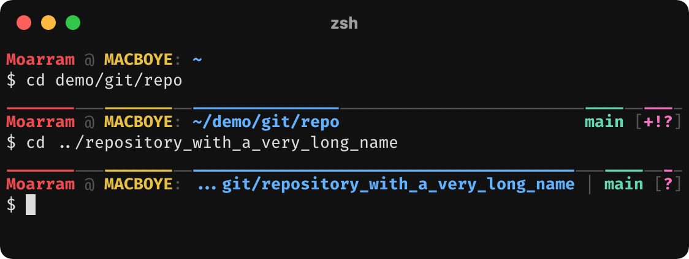
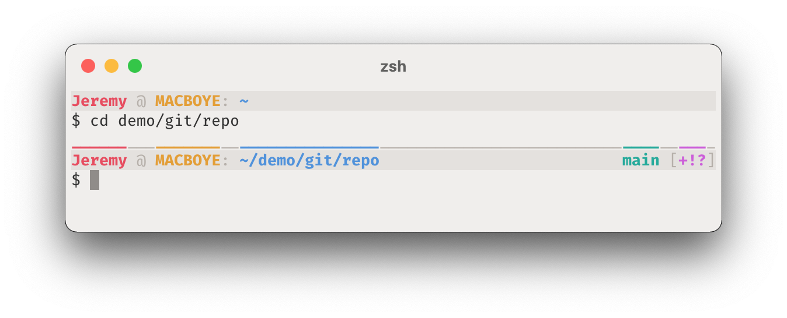
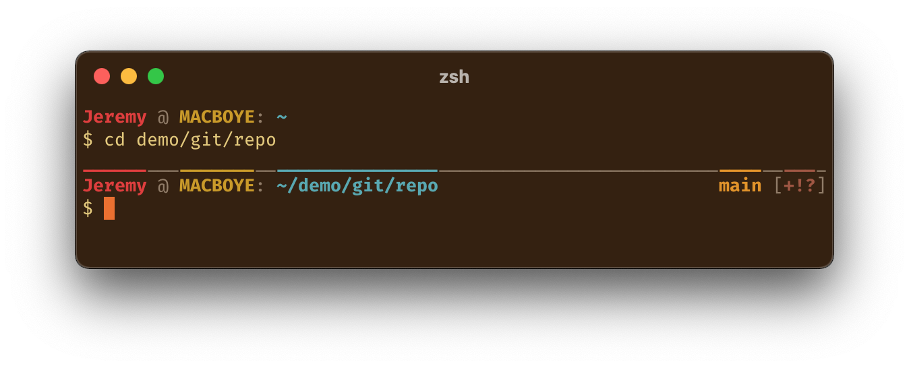

# Moarram's ZSH Theme
This ZSH theme features a colored separator bar and information bar, which adapt to terminal width. The information bar displays the user, host machine, path, Git branch (or commit), and Git status symbols. You can easily customize colors and certain characters by editing the theme file.

Screenshots taken from iTerm2. Using FiraCode font for the connected underscores.







```
________________________________________________________________________________
<user> @ <machine>: <path>                                   <branch> [<status>]
$
```


## Installation
### Dependencies
* `zsh` – shell
* `python` – [git status](https://travis-ci.org/olivierverdier/zsh-git-status) component

### Download
Clone the repository.

```
git clone https://github.com/Moarram/zsh-theme.git
```

### Setup
In your `~/.zshrc`, source the `moarram.zsh-theme` file.

```
source your/path/to/moarram.zsh-theme
```